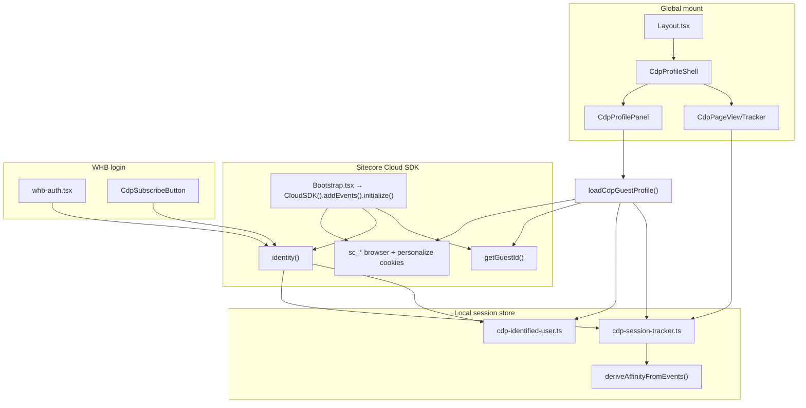

# CDP Engagement panel (Versele)

Rich **Engagement** side panel for DXP workshops. It visualizes visitor context from the **Sitecore Cloud SDK** plus a lightweight **local session tracker** — no CDP REST API credentials or `NEXT_PUBLIC_SITECORE_CDP_*` env vars.

The panel is ported from the industry-verticals demo (`CdpProfilePanel`) but uses **Cloud SDK only** (`getGuestId()`, `identity()`, `sc_*` cookies).

---

## What it does

| Audience | Purpose |
|----------|---------|
| **Workshop / demo** | Show guest ID, identity, page views, and affinity while browsing Versele or Welcome Home Buddy |
| **Developers** | Verify Cloud SDK init, `identity()` events, and cookie model without opening Sitecore AI |
| **Authors** | N/A — full profile history lives in **Sitecore AI → Performance → Profiles** |

Click the **teal square button** (bottom-right). The panel slides in from the right with collapsible sections for personal info, onsite behavior, and referral/session data.

---

## Architecture



---

## Mount and initialization

### 1. Panel mount (`_app.tsx`)

`CdpProfileShell` is dynamically imported with `ssr: false` in **`src/pages/_app.tsx`** so it appears on **every page** (Versele, WHB, 404, design library) — outside `Layout.tsx` so no route branch can skip it.

```tsx
const CdpProfileShell = dynamic(() => import('@/components/cdp-profile-panel/CdpProfileShell'), {
  ssr: false,
});
// … after I18nProvider / page component:
<CdpProfileShell />
```

Toggle button styles live in `cdp-profile-panel.css` (imported from `main.css`) with `z-index: 99999` so the button stays visible above headers and modals.

`CdpProfileShell` renders:

| Component | Role |
|-----------|------|
| `CdpPageViewTracker` | Records a `VIEW` event on every route change |
| `CdpProfilePanel` | Toggle button + side panel UI |

The panel appears on **every site** served by the `versele` rendering host (main Versele site, WHB, etc.).

### 2. Cloud SDK init (`Bootstrap.tsx`)

The Events SDK is initialized in production **normal** mode only:

- Requires `config.api.edge.clientContextId` (from `SITECORE_EDGE_CONTEXT_ID` / `.env.local`)
- `enableBrowserCookie: true` — sets `sc_*` cookies per [Cloud SDK cookies](https://doc.sitecore.com/sdk/en/developers/006/cloud-sdk/cloud-sdk-cookies.html)
- **Not** initialized in `development`, edit, or preview — guest ID may be empty locally until you run a production/preview build against XM Cloud

---

## Data sources

`loadCdpGuestProfile()` in `src/lib/cdp/cdp-cloud-context.ts` merges four sources:

| Source | API / store | Panel fields |
|--------|-------------|--------------|
| **Cloud SDK** | `getGuestId()` | CDP Guest ID |
| **Cookies** | `document.cookie` (`sc_*`) | Browser ID, personalize cookie name |
| **Identity** | `identity()` + `cdp-identified-user.ts` | Email, first name, last name, “Identified” flag |
| **Session tracker** | `sessionStorage` / `localStorage` | Page VIEW / IDENTITY events, visit count, affinity, session ref |

There is **no** call to Boxever / CDP REST (`api.boxever.com`). Affinity scores in the panel are **derived locally** from tracked page paths (life stage, WHB course, brand). Full affinity and profile history are in the Sitecore AI dashboard.

---

## File map

### Components (`src/components/cdp-profile-panel/`)

| File | Role |
|------|------|
| `CdpProfilePanel.tsx` | Full side panel: summary, affinity, subscribe, reset, personal info, onsite behavior, referral |
| `CdpSubscribeButton.tsx` | Email input → `identifyVisitorByEmail()`; used in panel and WHB login |
| `CdpPageViewTracker.tsx` | `useRouter()` → `recordPageView(path)` on navigation |
| `CdpProfileShell.tsx` | Mounts tracker + panel together |

### Libraries (`src/lib/cdp/`)

| File | Role |
|------|------|
| `cdp-identity.ts` | `identifyVisitorByEmail()` — calls `identity()`, persists user, records IDENTITY event |
| `cdp-identified-user.ts` | `localStorage` for email / first / last name after identify |
| `cdp-session-tracker.ts` | Session events, visit count, page context, affinity derivation |
| `cdp-cloud-context.ts` | `loadCdpGuestProfile()` — merges SDK + cookies + local state |
| `sitecore-cookie-reset.ts` | Clears `sc_*` cookies and local CDP storage; reloads page |

---

## Panel sections

### Summary card (always visible when profile loaded)

- **CDP Guest ID** — from `getGuestId()`; copy button
- **Browser ID** — value of the non-`_personalize` `sc_*` cookie
- **Personalize cookie** — name of the `*_personalize` cookie
- **Identified** — Yes if email was captured via `identity()`
- **Affinity** — grouped scores (e.g. `life_stage.Puppy`, `topics.Welcome Home Buddy`) from page paths
- **Subscribe / identify** — `CdpSubscribeButton` (same flow as WHB email login)
- **Restart as anonymous** — clears cookies + local tracker and reloads
- **Visit stats** — pages seen this session, current page name, total visit count

### Personal Information (collapsible)

Guest reference, guest ID, email, first/last name, and identifier list (`browser_id`, `guest_id`, `email`).

### Onsite Behavior (collapsible)

Recent session events (newest first, up to 12):

- **VIEW** — path, page name, and derived context (course, brand, site)
- **IDENTITY** — email from subscribe/login

Each event can expand **View data** for the full `arbitraryData` JSON.

### Referral (collapsible)

Session reference, channel (`WEB`), status (`OPEN`), HTTP referrer, and **Data extensions** JSON (same affinity object as summary). Footer note points to Sitecore AI Profiles for full history.

---

## Identity flow

### Subscribe button (panel or WHB)

```text
User enters email
  → identifyVisitorByEmail()
      → identity({ channel, currency, identifiers, email, firstName, lastName })
      → persistIdentifiedUser()     // localStorage
      → recordIdentityEvent()       // session tracker
  → panel refreshProfile()
```

First/last name are inferred from the email local part (e.g. `sumith.damodaran@…` → Sumith / Damodaran).

### WHB demo login (`whb-auth.tsx`)

| Action | CDP behavior |
|--------|----------------|
| **Email path** (`loginWithEmail`) | Calls `identifyVisitorByEmail()` |
| **Demo account** (`completeLogin`) | Calls `identifyVisitorByEmail(WHB_DEMO_EMAIL)` after code step |
| **Logout** | Clears WHB `localStorage` only — does **not** reset CDP cookies (use **Restart as anonymous** in panel) |

WHB UI auth remains demo-only (`whb-demo-auth` in `localStorage`); CDP identity is the real Cloud SDK event for workshop storytelling.

---

## Page view and affinity

`CdpPageViewTracker` runs on `router.asPath` changes and calls `recordPageView(path)`.

`derivePageContext()` enriches each VIEW with:

| Path hint | Context field |
|-----------|---------------|
| `/puppy`, `/puber`, … | `course` |
| `/welcome-home-buddy`, `/whb` | `site: Welcome Home Buddy` |
| `/opti-life`, `/products` | `brand: Opti Life` |

`deriveAffinityFromEvents()` normalizes scores into `life_stage` and `topics` groups (0.000–1.000). Browsing WHB Puppy lessons increases Puppy / Welcome Home Buddy affinity in the panel.

---

## Restart as anonymous

**Restart as anonymous** in the panel:

1. Expires all `sc_*` cookies (multiple domain variants)
2. Clears identified user, session events, and visit count from storage
3. Reloads the page after ~600 ms

Use this between demo runs so the next visitor gets a fresh guest ID and visit count.

---

## Environment and troubleshooting

| Issue | Cause | Fix |
|-------|--------|-----|
| **No teal button at all** | Old build without CDP code, or viewing cached bundle | Restart dev server (`npm run dev`); hard-refresh browser; redeploy rendering host on XM Cloud |
| Guest ID shows “Waiting for Cloud SDK…” | SDK not init (dev mode) or missing Edge context | Use production/preview build; set `SITECORE_EDGE_CONTEXT_ID` in `.env.local` |
| No VIEW events | Panel opened before navigation | Browse a few pages; panel auto-refreshes on route change when open |
| Identified = Anonymous after WHB login | Identity failed silently | Check browser console; confirm Bootstrap initialized (not edit/preview) |
| Affinity empty | No matching path segments yet | Visit `/puppy` or WHB home under `welcome-home-buddy` site |
| Old guest ID after reset | Cookies on parent domain | Use panel reset (handles domain variants) or clear site data manually |

**Required env vars** (same as rest of Versele — no CDP-specific keys):

- `SITECORE_EDGE_CONTEXT_ID`
- `NEXT_PUBLIC_SITECORE_EDGE_CONTEXT_ID`
- `NEXT_PUBLIC_SITECORE_EDGE_PLATFORM_HOSTNAME`

---

## Related docs

- [WELCOME_HOME_BUDDY.md](../../../../../docs/WELCOME_HOME_BUDDY.md) — WHB login + CDP integration
- [VERSELE.md](../../../../../docs/VERSELE.md) — demo storyline and shared rendering host
- [Cloud SDK cookies](https://doc.sitecore.com/sdk/en/developers/006/cloud-sdk/cloud-sdk-cookies.html)
- [Cloud SDK for JavaScript](https://doc.sitecore.com/sdk/en/developers/005/cloud-sdk/sitecore-cloud-sdk-for-javascript.html)
